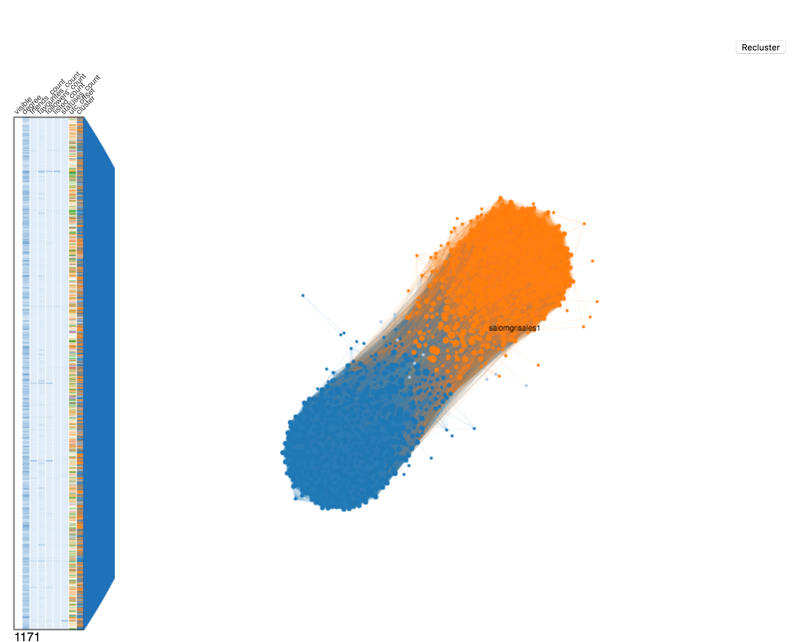

# NodeNavigator

**NodeNavigator** is a d3 visualization widget to help summarizing, browsing and navigating large network visualizations.
<a href="https://d3js.org"></a>
## Resources

* [Examples](https://github.com/john-guerra/NodeNavigator)


## Installing

```html
<script src="d3.v4.min.js"></script>
<script src="netClustering.js"></script>
<script src="forceInABox.js"></script>
<script src="path/to/NodeNavigator.js"></script>
```
## Basic Usage

1. Use the next template. The id of the button, the div and the canvas is crucial for proper execution
```html
<!DOCTYPE html>
<html lang="en">
<head>
  <meta charset="UTF-8">
  <meta name="viewport" content="width=device-width, initial-scale=1.0">
  <meta http-equiv="X-UA-Compatible" content="ie=edge">
  <title>Title</title>
  <link rel="stylesheet" href="assets/css/main.css">
</head>
<body>

  <h1>Example</h1>
  <button id="recluster">Recluster</button>
  <div id="nn"></div>
  <canvas id="graph" width="800" height="800"></canvas>


  <script src="path/to/d3.v4.min.js"></script>
  <script src="path/to/netClustering.js"></script>
  <script src="path/to/forceInABox.js"></script>
  <script src="path/to/NodeNavigator.js"></script>
</body>
</html>

```
2. Create and import a new JavaScript file below the scripts above (d3, netClustering, forceInABox and NodeNavigator) or right in the html like in the example below.
```html
<script src="path/to/d3.v4.min.js"></script>
<script src="path/to/netClustering.js"></script>
<script src="path/to/forceInABox.js"></script>
<script src="path/to/NodeNavigator.js"></script>
<script type="text/javascript">
  (function () {
    "use strict";
    /* global d3, forceInABox, NodeNavigator */
  })();
</script>
```
3. Add the following JavaScript code.

```javascript
(function () {
"use strict";
/* global d3, forceInABox, NodeNavigator */

var canvas = d3.select("#graph").node(),
  context = canvas.getContext("2d"),
  width = canvas.width,
  height = canvas.height,
  selected = null;
var size = d3.scaleLinear().range([2,5]);

var color = d3.scaleOrdinal(d3.schemeCategory20);
// here you can add your custom force simulation
var simulation = d3.forceSimulation()
    .force("link", d3.forceLink())
    .force("charge", d3.forceManyBody().strength(-5))
    .force("center", d3.forceCenter(width/2, height/2));

/**
here is where you add the path to the json file you will use. The dataset must be structured as follow:

{
  "nodes": [
    { "attribute": "value", "attribute":"value"}
  ],
  "links": [
    { "source": "value", "target":"value" }
  ]
}

*/
d3.json("VotacionesSenado2017.json", onLoadJSON);
function onLoadJSON(error, graph) {
  if (error) throw error;
  var dicNodes = d3.map();
  //mapping nodes
  graph.nodes.forEach(function (n) {
    n.degree = 0;
    n.visible = true;
    //here you define the id you will use for each one of your nodes, could be an id that already is in the dataset or a custom id
    n.id = n.name;
    dicNodes.set(n.id, n);
  });
  graph.links.forEach(function (e) {
    if (dicNodes.has(e.source)) {
      e.source = dicNodes.get(e.source);
    } else {
      e.source = {
        id:e.source,
        name:e.source,
        degree:0,
        // cluster: -1,
        screen_name:e.target.name,
        count:e.count
      };
      dicNodes.set(e.source.id, e.source);
    }

    e.source.degree+=1;

    if (dicNodes.has(e.target)) {
      e.target = dicNodes.get(e.target);
    } else {
      e.target = {
        id:e.target,
        name:e.target,
        degree:0,
        // cluster: -1,
        screen_name:e.target.name,
        count:e.count
      };
      dicNodes.set(e.target.id, e.target);
    }
    e.target.degree+=1;
  });
  var minDegree = 2;
  var filteredLinks = graph.links;
  var filteredGraph = {
    nodes: dicNodes.values(),
    links: filteredLinks
  };


  nodeNavigator.links(filteredGraph.links);
  nodeNavigator.data(filteredGraph.nodes);
  nodeNavigator.updateCallback(function (nodes) {
    update({
      nodes:nodes,
      links:graph.links
    });
  });
  update(filteredGraph);
};


var nodeNavigator = new NodeNavigator(
  "#nn",
  height
).id("name");
/*here is where you set the columns that the widget will display. you can add categorical or sequential attribute. Both receive as a parameter the name and an optional scale.
the default scale for categorical attributes is d3.scaleOrdinal(d3.schemeCategory20)
and the default scale for sequential attributes is d3.scaleLinear()
*/
nodeNavigator.addSequentialAttrib("degree");
nodeNavigator.addCategoricalAttrib("party");
nodeNavigator.addCategoricalAttrib("cluster", color);
function update(graph) {
  simulation.stop();
  var dVisibleNodes = {};
  graph.nodes.map(function (n) {
    return dVisibleNodes[n.id] = true;
  });
  var visibleLinks = graph.links.filter(function (d) {
    return dVisibleNodes[d.source.id]&&
      dVisibleNodes[d.target.id];
  });
  console.log("nodes = " + graph.nodes.length + " links="+visibleLinks.length);
  size.domain(d3.extent(nodeNavigator.getVisible(), function (d) { return d.degree; }));
  graph.nodes.forEach(function (d) {
    d.r = size(d.degree);
  });
  var clusters = d3.nest()
    .key(function(d) { return d.cluster; })
    .entries(nodeNavigator.getVisible())
    .sort(function(a, b) { return b.values.length - a.values.length; });
  var groupingForce = forceInABox()
        .links(graph.links)
        .template("force")
        .groupBy("cluster")
        .linkStrengthInterCluster(0.001)
        .linkStrengthIntraCluster(0.000001)
        .size([width, height]);
  simulation
      .nodes(nodeNavigator.getVisible())
      .on("tick", ticked);
  simulation.force("link")
            .links(visibleLinks);
  d3.select(canvas)
      .on("mousemove", onHover)
      .call(d3.drag()
          .container(canvas)
          .subject(dragsubject)
          .on("start", dragstarted)
          .on("drag", dragged)
          .on("end", dragended));
  d3.select("#recluster")
    .on("click", function () {
      console.log("Clustering");
      netClustering.cluster(nodeNavigator.getVisible(), visibleLinks);
      console.log("done");
      update(graph);
    });
  simulation.alpha(0.7).restart();
  function ticked() {
    context.clearRect(0, 0, width, height);
    if (simulation.alpha() < 0.05) {
      context.save();
      visibleLinks.forEach(drawLink);
      context.restore();
    }
    clusters.forEach(function(cluster) {
      context.beginPath();
      context.globalAlpha = 1;
      cluster.values.forEach(drawNode);
      context.fillStyle = color(cluster.key);
      context.fill();
      context.beginPath();
      context.fillStyle = "black";
      context.fill();
    });

    if (selected) {
      context.beginPath();
      context.fillStyle = "black";
      drawNodeText(selected);
      context.fill();

    }
    context.restore();
  }

  function dragsubject() {
    return simulation.find(d3.event.x, d3.event.y);
  }
}

function onHover() {
  var d = simulation.find(d3.event.x, d3.event.y);
  selected = d;
  drawNodeText(selected);
}

function dragstarted() {
  if (!d3.event.active) simulation.alphaTarget(0.3).restart();
  d3.event.subject.fx = d3.event.subject.x;
  d3.event.subject.fy = d3.event.subject.y;
}

function dragged() {
  d3.event.subject.fx = d3.event.x;
  d3.event.subject.fy = d3.event.y;
}

function dragended() {
  if (!d3.event.active) simulation.alphaTarget(0);
  d3.event.subject.fx = null;
  d3.event.subject.fy = null;
}

function drawLink(d) {
  context.beginPath();
  // context.strokeStyle = "rgba(180,180,180,0.01)";
  context.strokeStyle = color(d.target.cluster);
  context.globalAlpha=0.1;
  context.moveTo(d.source.x, d.source.y);
  context.lineTo(d.target.x, d.target.y);
  context.stroke();
}


function drawNode(d) {
  context.moveTo(d.x + d.r/2, d.y + d.r/2);
  context.arc(d.x, d.y, d.r, 0, 2 * Math.PI);
}

function drawNodeText(d) {
  context.beginPath();
  context.fillStyle = "black";
  context.moveTo(d.x + d.r/2, d.y + d.r/2 + 5);
  context.fillText(d.name, d.x, d.y);
  context.fill();

}
})();
```


## License
Animate.css is licensed under the MIT license. (http://opensource.org/licenses/MIT)
