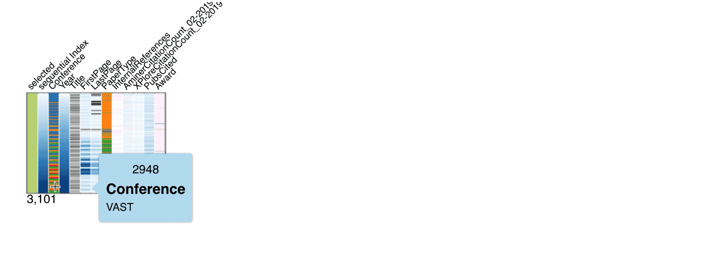
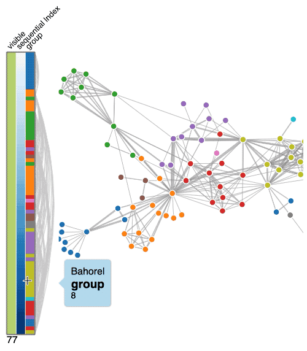
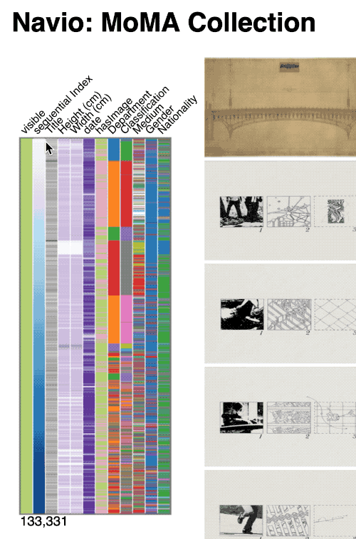
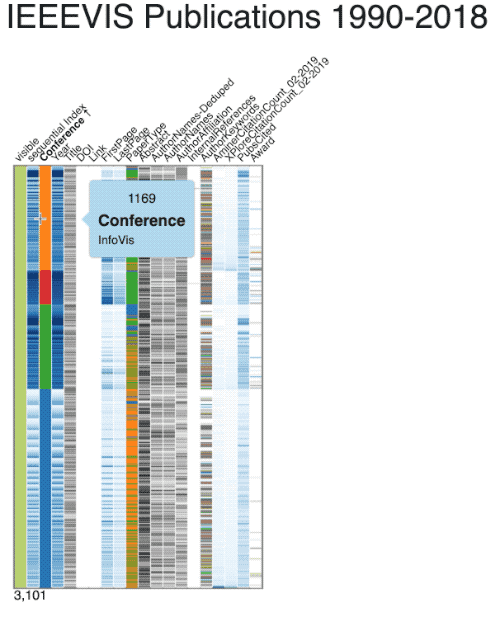
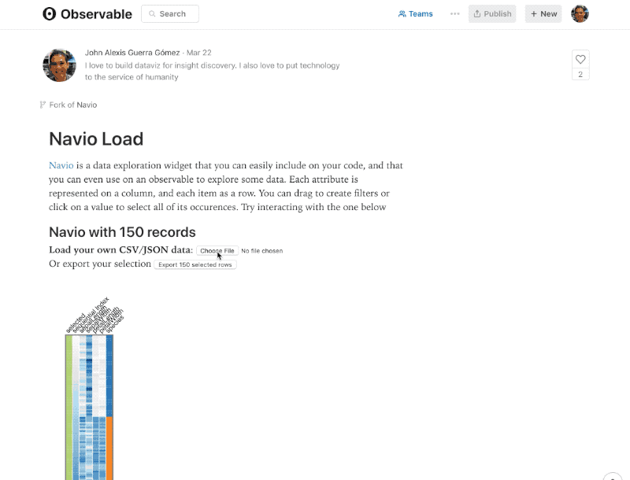
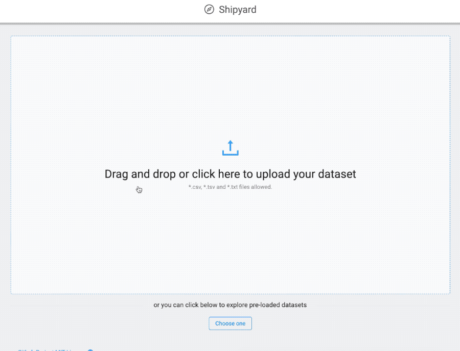
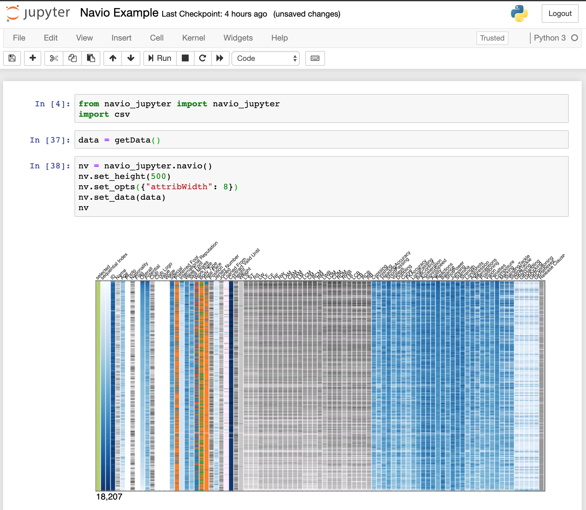
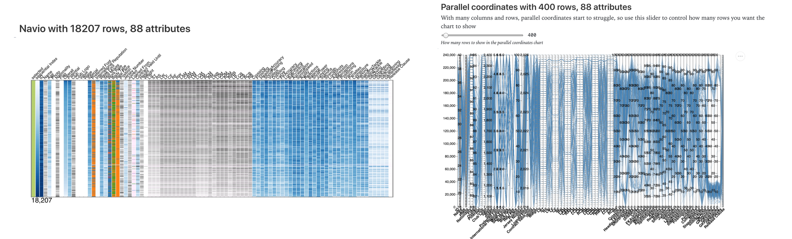
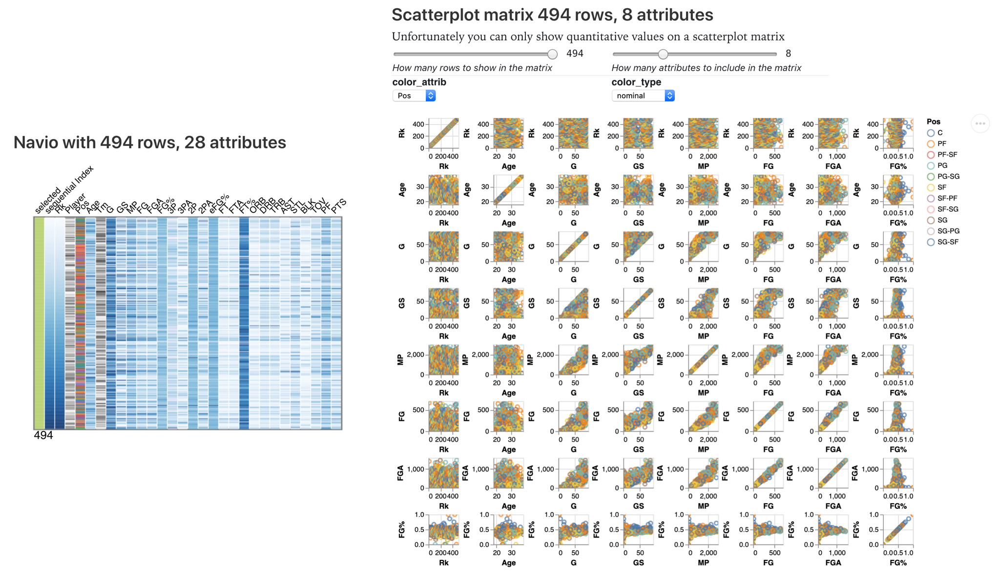

<h1 align="center">
  <br>
  <a href="https://observablehq.com/@john-guerra/navio-load"></a>
  Navio
  <br>
</h1>
<h4 align="center">A visualization widget to understand and navigate your data</h4>

You can use it to summarize hundreds of thousands of records a dozens of columns, explore and navigate them with three simple interactions:

| Sort | Filter a Range | Filter By Value|
| -----| --- | ---|
| Click on a header to sort <br> <a href="https://navio.dev/example_vispubdata"></a> | Drag to select a range <br> <a href="http://infovis.co/momaExplorer/"></a> | Click on a value to select all instances <br> <a href="https://navio.dev/example_vispubdata"> </a> |

## Try it!

You can test Navio right now with your **own CSV or JSON data** (less than 200MB), using:

| Obervable Notebook | Shipyard | Jupyter Notebook |
| ---- | --- | --- |
| <a href="https://beta.observablehq.com/@john-guerra/navio-load"> </a> | <a href="https://shipyard.navio.dev"> </a> | <a href="https://github.com/john-guerra/navio_jupyter"> </a>

Other demos:

* [MoMa Collection](https://john-guerra.github.io/momaExplorer/) ([Code](https://github.com/john-guerra/momaExplorer))
* [Navio-only Vast 2017 MiniChallenge1 ](http://john-guerra.github.io/navio/example_vastChallenge2017/index.html) ([Code](https://github.com/john-guerra/navio/tree/master/example_vastChallenge2017))
* [Co-voting patterns of the Colombian senate](http://johnguerra.co/viz/senadoColombia)
* [Simplest example with Networks on SVG](https://john-guerra.github.io/navio/example/) ([Code](https://github.com/john-guerra/navio/tree/master/example))
* [Simple example with Networks on Canvas](https://john-guerra.github.io/navio/exampleSenate/) ([Code](https://github.com/john-guerra/navio/tree/master/exampleSenate))
* [IEEEVIS Publications Data](https://john-guerra.github.io/navio/example_vispubdata/) ([Code](https://github.com/john-guerra/navio/blob/master/example_vispubdata/index.html)) ([Observable Notebook](https://observablehq.com/@john-guerra/navio))

# Comparing

Why using something else for summarizing your data?. Here is how Navio compares with other alternatives:

**Navio vs Parallel Coordinates**

You can use [this Notebook to compare Navio with Parallel Coordinates](https://observablehq.com/@john-guerra/navio-vs-parallel-coordinates), using your own data. Please be aware that the Vegalite implementation of Parallel Coordinates will break with a few thousand rows (on the image below it broke with 500 rows and 86 attributes of the [fifa19 Kaggle Dataset](https://www.kaggle.com/karangadiya/fifa19
))

<a href="https://observablehq.com/@john-guerra/navio-vs-parallel-coordinates">
  
</a>

**Navio vs Scatterplot Matrix**

Use [this Notebook to compare Navio with a Scatterplot Matrix](https://observablehq.com/@john-guerra/navio-vs-scatterplot-matrix), using your own data. Please be aware that the Vegalite implementation of the Scatterplot Matrix only support quantitative attributes and will also break with a dozen attributes and a few hundred rows), therefore the image below only displayed 8 attributes (out of the 28) on the scatterplot matrix.

<a href="https://observablehq.com/@john-guerra/navio-vs-scatterplot-matrix">
  
</a>


# Install

```js
npm install navio
```

Or use it from unpkg

```html
  <script type="text/javascript" src="https://d3js.org/d3.v4.min.js"></script>
  <script src="https://d3js.org/d3-scale-chromatic.v1.min.js"></script>
  <script src="https://unpkg.com/popper.js@1.14/dist/umd/popper.min.js"></script>
  <script type="text/javascript" src="https://unpkg.com/navio/dist/navio.min.js"></script>
```

Requires [^popper.js@0.14](https://github.com/FezVrasta/popper.js/), [^d3@4.13](http://d3js.org) and [d3-scale-chromatic](https://github.com/d3/d3-scale-chromatic) (unless you use d3.v5).

# Usage

TLDR

```html
<!DOCTYPE html>
<body>
  <!-- Placeholder for the widget -->
  <div id="navio"></div>

  <!-- NAVIO Step 0: Load the libraries -->
  <script type="text/javascript" src="https://d3js.org/d3.v4.min.js"></script>
  <script src="https://d3js.org/d3-scale-chromatic.v1.min.js"></script>
  <script src="https://unpkg.com/popper.js@1.14/dist/umd/popper.min.js"></script>
  <script type="text/javascript" src="https://unpkg.com/navio/dist/navio.min.js"></script>

<script>
  // NAVIO  Step 1.  Create a Navio passing a d3 selection to place it and an optional height
  var nv = navio(d3.select("#navio"), 600);

  d3.csv(YOUR_DATA, function (err, data) {
    if (err) throw err;

    // NAVIO Step 2. Load your data!
    nv.data(data);

    // NAVIO Step 3. Detect your attributes (or load them manually)
    nv.addAllAttribs();

    // Optional, setup a selection callback
    nv.updateCallback( selected => console.log("selected in Navio: ", selected.length));
  });
</script>
</body>
</html>
```
### Step by step
1. **HTML**. Start with this template
```html
<!DOCTYPE html>
<html lang="en">
<head>
  <meta charset="UTF-8">
  <meta name="viewport" content="width=device-width, initial-scale=1.0">
  <meta http-equiv="X-UA-Compatible" content="ie=edge">
  <title>Basic Usage</title>
</head>
<body>

  // Your Navio widget goes here
  <div id="Navio"></div>

</body>
</html>

```
2. **Import Navio**. Create and import a new JavaScript file below the scripts (d3 and Navio) or right in the html like in the example below.
```html
<script src="https://d3js.org/d3.v4.min.js"></script>
<script type="text/javascript" src="https://john-guerra.github.io/navio/Navio.js"></script>
<script type="text/javascript">
  //   YOUR_JS_CODE_HERE
</script>
```

3. **Create a Navio Instance**

``` javascript
var nv = navio(d3.select("#Navio"), 600); //height 600
```

4. [Optional] **Configure navio to your liking**

```javascript
// Default parameters
nv.x0 = 0;  //Where to start drawing navio in x
nv.y0 = 100; //Where to start drawing navio in y, useful if your attrib names are too long
nv.maxNumDistictForCategorical = 10; // addAllAttribs uses this for deciding if an attribute is categorical (has less than nv.maxNumDistictForCategorical categories) or ordered
nv.maxNumDistictForOrdered = 90; // addAllAttribs uses this for deciding if an attribute is ordered (has less than nv.maxNumDistictForCategorical categories) or text. Use nv.maxNumDistictForOrdered = Infinity for never choosing Text

nv.howManyItemsShouldSearchForNotNull = 100; // How many rows should addAllAttribs search to decide guess an attribute type
nv.margin = 10; // Margin around navio

nv.levelsSeparation = 40; // Separation between the levels
nv.divisionsColor = "white"; // Border color for the divisions
nv.levelConnectionsColor = "rgba(205, 220, 163, 0.5)"; // Color for the conections between levels
nv.divisionsThreshold = 4; // What's the minimum row height needed to draw divisions
nv.fmtCounts = d3.format(",.0d"); // Format used to display the counts on the bottom
nv.legendFont = "14px sans-serif"; // The font for the header
nv.nestedFilters = true; // Should navio use nested levels?

nv.showAttribTitles = true; // Show headers?
nv.attribWidth = 15; // Width of the columns
nv.attribRotation = -45; // Headers rotation
nv.attribFontSize = 13; // Headers font size
nv.attribFontSizeSelected = 32; // Headers font size when mouse over

nv.filterFontSize = 10; // Font size of the filters explanations on the bottom

nv.tooltipFontSize = 12; // Font size for the tooltip
nv.tooltipBgColor = "#b2ddf1"; // Font color for tooltip background
nv.tooltipMargin = 50; // How much to separate the tooltip from the cursor
nv.tooltipArrowSize = 10; // How big is the arrow on the tooltip

nv.digitsForText = 2; // How many digits to use for text attributes

nv.id("attribName"); // Shows this id on the tooltip, should be unique

nv.addAllAttribsRecursionLevel = Infinity; // How many levels depth do we keep on adding nested attributes
nv.addAllAttribsIncludeObjects = false; // Should addAllAttribs include objects
nv.addAllAttribsIncludeArrays = false; // Should addAllAttribs include arrays

// Default colors for values
nv.nullColor = "#ffedfd"; // Color for null values
nv.defaultColorInterpolator = d3.interpolateBlues;
nv.defaultColorInterpolatorDate = d3.interpolatePurples;
nv.defaultColorInterpolatorDiverging = d3.interpolateBrBG;
nv.defaultColorInterpolatorOrdered = d3.interpolateOranges;
nv.defaultColorInterpolatorText = d3.interpolateGreys;
nv.defaultColorRangeBoolean = ["#a1d76a", "#e9a3c9", "white"]; //true false null
nv.defaultColorRangeSelected = ["white", "#b5cf6b"];
nv.defaultColorCategorical = d3.schemeCategory10;

// // Discouraged: If you want to break perceptual rules to have many more categories use
// // the following "Piñata mode 🎉"
// nv.defaultColorCategorical = d3.schemeCategory10
//   .concat(d3.schemeAccent)
//   .concat(d3.schemePastel1)
//   .concat(d3.schemeSet2)
//   .concat(d3.schemeSet3);
// nv.maxNumDistictForCategorical = nv.defaultColorCategorical.length;

```

4. [Optional] **Add your attributes manually**. Navio supports six types of attributes: categorical, sequential (numerical), diverging (numerical with negative values), text, date and boolean. You can either add them manually or use `nv.addAllAttribs()` to auto detect them (must be called after seting the data with `nv.data(your_data)`)

```javascript
nv.addCategoricalAttrib("attribName", [customScale]);
nv.addSequentialAttrib("attribName", [customScale]);
nv.addDivergingAttrib("attribName", [customScale]);
nv.addTextAttrib("attribName", [customScale]); // Colors by the first nv.digitsForText
nv.addOrderedAttrib("attribName", [customScale]); // Sorts and then colors by rank
nv.addDateAttrib("attribName", [customScale]);
nv.addBooleanAttrib("attribName", [customScale]);
```

If you ommit the [customScale] parameter it will use the defaults. You can also create your own custom made parameters using `nv.addAttrib("attribName", customScale)`. For example, if you already have a scale for setting the colors of a `cluster` property on your visualization, you can tell navio to use the same matching colors. Make sure to set the domain and range of the scale, as navio will not try to do it with this function.

```javascript
var color = d3.scaleOrdinal(d3.schemeSet3)
  .domain["cluster1", "cluster2", "cluster3"];

nv.addAttrib("cluster", color);

```


5. **Set the data**

After loading your data pass it to navio. This will trigger the drawing operation. You can force redrawing using `nv.update();`
``` javascript
nv.data(myData);
```

If your data is a network, or you have some links in the same format of a [d3.forceSimulation](https://github.com/d3/d3-force#links) you can also add them to navio using `nv.links([links])`. This won't trigger a redraw, so make sure to call it before setting your data

``` javascript
nv.links(myLinks);
nv.data(myData);
```

6. **Detect Attributes**. navio also includes a function that detects the attributes automatically, which is slow, redraws the whole thing, and my be buggy. Use it at your own risk. But make sure to call it after setting your data

``` javascript
nv.data(myData);
nv.addAllAttribs();
```

7. **Set a callback**. A function that navio will call when the user filters/sort the data
``` javascript
nv.updateCallback( data => console.log("The filtered data is ", data));
```

## Other methods

<a name="update" href="#update">#</a> <i>nv</i>.<b>update</b>() [<>](https://github.com/john-guerra/navio/blob/master/src/navio.js#L1443 "Source")

Use it to force a redraw of navio after changing the underlying data without losing the filters. Useful in case you modify the data with some other action in your code, e.g. you recomputed clusters in a network chart.

<a name="hardUpdate" href="#hardUpdate">#</a> <i>nv</i>.<b>hardUpdate</b>([opts]) [<>](https://github.com/john-guerra/navio/blob/master/src/navio.js#L1443 "Source")

Slower update that recomputes brushes and checks for parameters. Use it if you change any parameters or added new attributes after calling .data. opts can be an object that contains any of the following attributes:

* shouldDrawBrushes (defaults true)
* shouldUpdateColorDomains (defaults true)
* recomputeBrushes (defaults true)
* levelsToUpdate (defaults all levels, should be an array of indices)

<a name="getColorScales" href="#getColorScales">#</a> <i>nv</i>.<b>getColorScales</b>(attr
) [<>](https://github.com/john-guerra/navio/blob/master/src/navio.js#L1737 "Source")

Returns the color scale for a certain attribute, make sure to pass an attribute that has been already added

<a name="getAttribs" href="#getAttribs">#</a> <i>nv</i>.<b>getAttribs</b>(
) [<>](https://github.com/john-guerra/navio/blob/master/src/navio.js#L1742 "Source")

Returns the ordered list of attributes added to navio

## License

Navio.js is licensed under the MIT license. (http://opensource.org/licenses/MIT)
