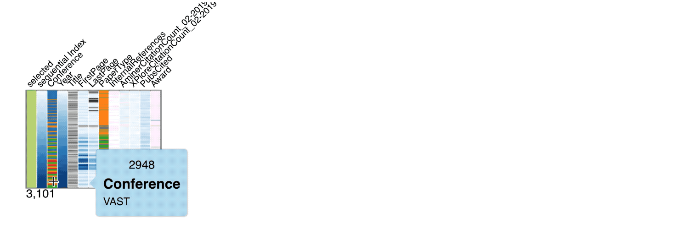
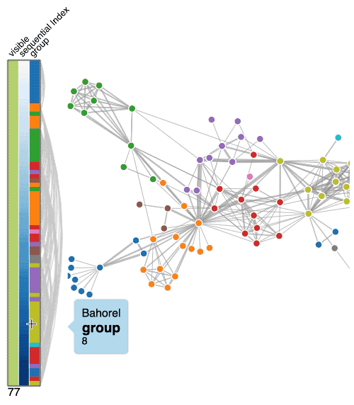
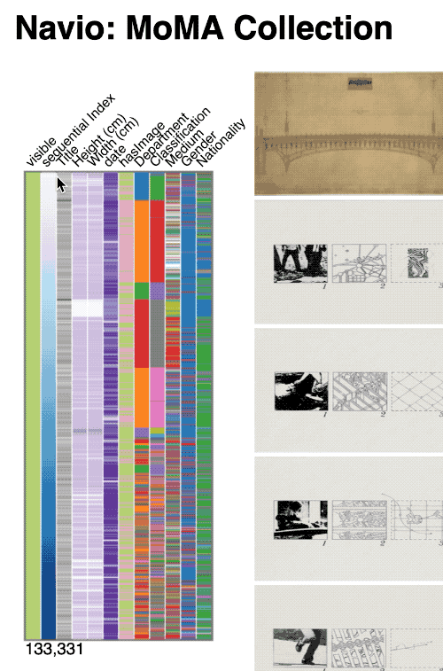
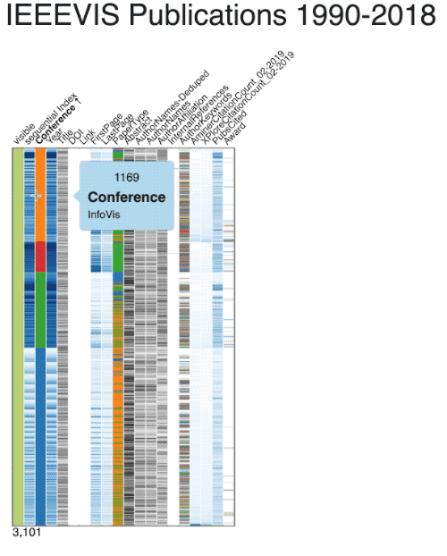
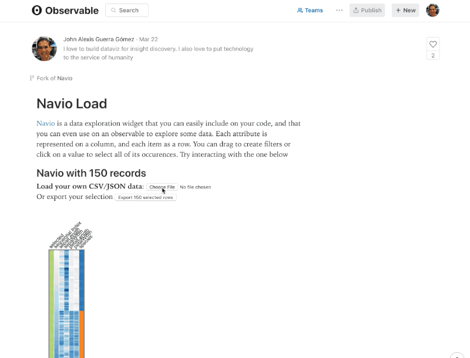
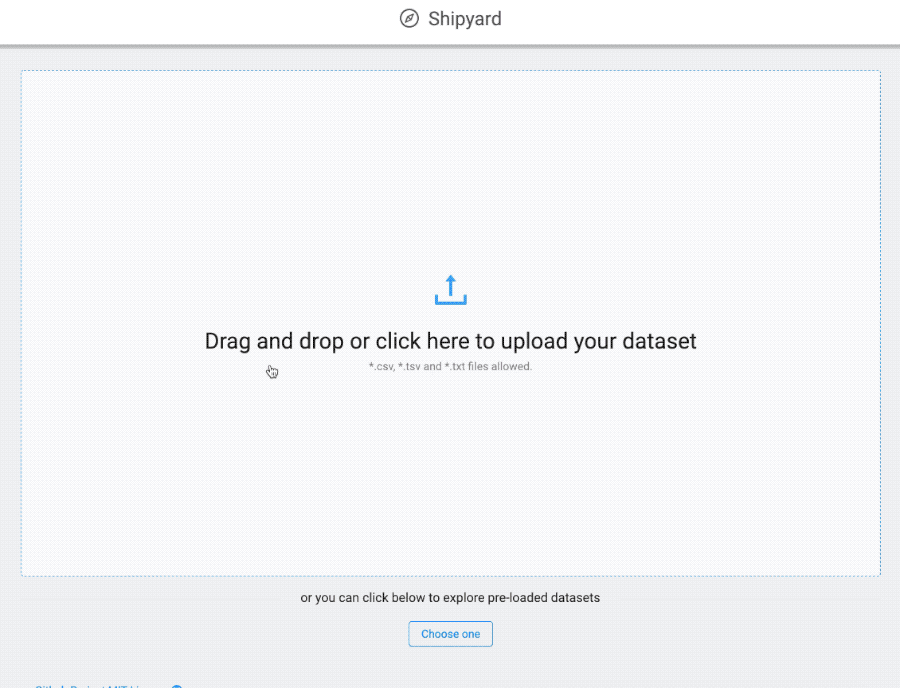
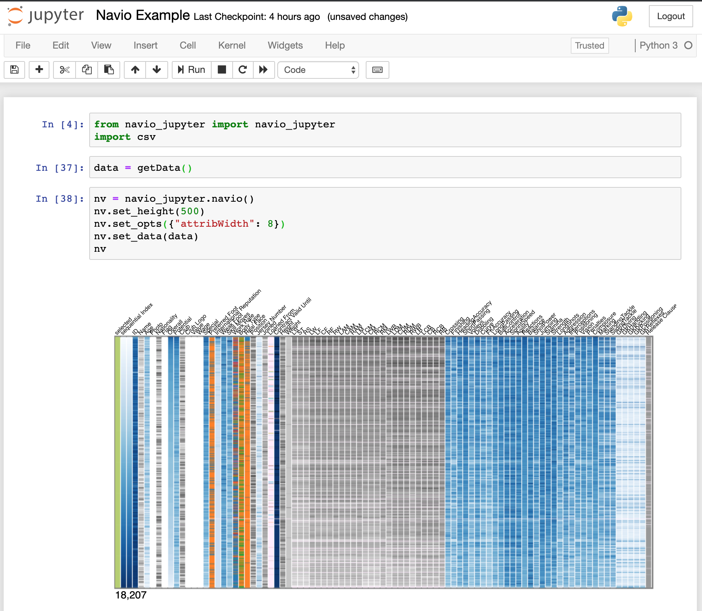
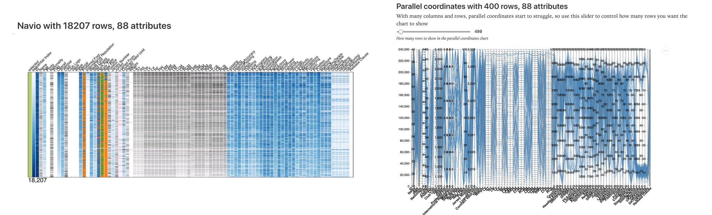
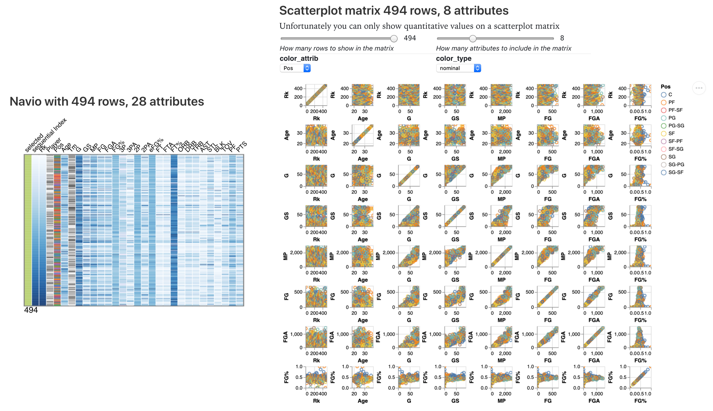

<!-- Place this tag where you want the button to render. -->
<a style="text-align: right" class="github-button" href="https://github.com/john-guerra/navio" data-icon="octicon-star" data-size="large" aria-label="Star john-guerra/navio on GitHub">Star</a>

<div align="center">
  <h1>
    <a href="https://observablehq.com/@john-guerra/navio-load"></a>
    Navio:
    <small><div style="font-style: italic; margin-bottom: 1.3em" align="center">A visualization widget to understand and explore your data</div></small>
  </h1>
</div>


Use it to <strong>summarize</strong>, <strong>explore</strong> and <strong>navigate</strong> your multivariate data using three simple interactions:

| Sort | Filter a Range | Filter By Value|
| -----| --- | ---|
| Click on a header to sort <br> <a href="https://navio.dev/examples/vispubdata"></a> | Drag to select a range <br> <a href="https://john-guerra.github.io/momaExplorer"></a> | Click on a value to select all instances <br> <a href="https://navio.dev/examples/vispubdata"> </a> |

## Upgrading to 0.3.0

Three changes need a look before you upgrade.

**`height` is now the RECORD extent, not the widget's total size.** The column
headers are drawn in a band that is *added* on top of it rather than carved out
of it, so the data area is `height` however long your attribute names are.
Before, a 180px widget with the default `y0: 100` drew **40px of rows**, and
`y0: 140` drew none at all. Your widgets will be roughly the old `y0` taller —
set `height` down by that much if you need the previous footprint.

The band is measured from the labels now (`autoHeaderSpace`, on by default), so
short names stop paying for headroom they never use, and long ones stop being
cut off. Past `headerMaxSpace` (140px) the extra hangs above the widget rather
than growing it — which means it also overlaps whatever is above it, and takes
clicks meant for it.

**A container with no `id` no longer remembers its settings.** The key used to
fall back to a per-page construction counter, which is not an identity: build
two Navios in a different order on the next load and each restored the other's
hidden columns and attribute types. Give the container a stable `id`, or set
`settingsKey` yourself, and persistence works as before. `settingsKey` passed in
the options object also works now — it was being rejected as an unknown option.

**Categorical columns are a different colour, and there are more of them.**
`defaultColorCategorical` was `d3.schemeCategory10`; it is now a generated
50-colour palette, and `maxNumDistinctForCategorical` goes from 10 to 30 — the
old value was the length of that scheme rather than a judgement about data, so
a column with 12 categories used to fall back to being treated as text. The new
palette opens on colours close to `schemeCategory10`'s, so a small column still
looks ordinary, and it measures 9.8 minimum pairwise CIEDE2000 across normal and
the three dichromacies where `schemeCategory10` itself measures 1.6 — below the
just-noticeable difference. `nv.defaultColorCategorical = navio.palettes.category10`
restores the old look exactly, recycling included.

Navio also follows the page's background now, so its labels and chrome are
readable on a dark one. Tell it directly if you already know:

```javascript
const nv = navio(d3.select("#nv"), { height: 400, theme: "dark" });
```

`theme` defaults to `"auto"`, which reads the background behind the widget and
re-reads it on every redraw — so a widget in a dark panel on a light page comes
out dark, which the reader's OS setting could never have told it. There is a
Theme control in the settings panel as well. The DATA colours never change with
it: inverting a categorical scale would change what a colour means.

Settings stored by 0.2.x that spell out the old row divider and tooltip colours
are migrated rather than honoured, since those were defaults and not choices.

## Try it!

You can test Navio right now with your **own CSV or JSON data** (less than 200MB), using:

| Obervable Notebook | Shipyard | Jupyter Notebook |
| ---- | --- | --- |
| <a href="https://beta.observablehq.com/@john-guerra/navio-load"> </a> | <a href="https://shipyard.navio.dev"> </a> | <a href="https://github.com/john-guerra/navio_jupyter"> </a>

Other demos:

* [MoMa Collection](https://john-guerra.github.io/momaExplorer/) ([Code](https://github.com/john-guerra/momaExplorer))
* [Navio-only Vast 2017 MiniChallenge1 ](http://john-guerra.github.io/navio/examples/vast-challenge-2017/index.html) ([Code](https://github.com/john-guerra/navio/tree/master/examples/vast-challenge-2017))
* [Co-voting patterns of the Colombian senate](http://johnguerra.co/viz/senadoColombia)
* [Categorical palettes](https://john-guerra.github.io/navio/examples/palettes/) ([Code](https://github.com/john-guerra/navio/tree/master/examples/palettes)) — 25 categories, and how to change `nv.defaultColorCategorical`
* [Dark mode](https://john-guerra.github.io/navio/examples/theme/) ([Code](https://github.com/john-guerra/navio/tree/master/examples/theme)) — `nv.theme` following the page
* [Simplest example with Networks on SVG](https://john-guerra.github.io/navio/examples/basic/) ([Code](https://github.com/john-guerra/navio/tree/master/examples/basic))
* [Simple example with Networks on Canvas](https://john-guerra.github.io/navio/examples/senate/) ([Code](https://github.com/john-guerra/navio/tree/master/examples/senate))
* [IEEEVIS Publications Data](https://john-guerra.github.io/navio/examples/vispubdata/) ([Code](https://github.com/john-guerra/navio/blob/master/examples/vispubdata/index.html)) ([Observable Notebook](https://observablehq.com/@john-guerra/navio))
* [Horizontal and vertical, side by side](https://navio.dev/examples/orientation/) ([Code](https://github.com/john-guerra/navio/blob/master/examples/orientation/index.html))
* [Inside an Observable notebook](https://navio.dev/examples/observable/) ([Code](https://github.com/john-guerra/navio/blob/master/examples/observable/index.html)) — runs through the real `@observablehq/runtime`, in the cell layout a notebook actually produces
* [Bound to another widget with `Inputs.bind`](https://navio.dev/examples/binding/) ([Code](https://github.com/john-guerra/navio/blob/master/examples/binding/index.html))

# Comparing

Why using something else for summarizing your data?. Here is how Navio compares with other alternatives:

**Navio vs Parallel Coordinates**

You can use [this Notebook to compare Navio with Parallel Coordinates](https://observablehq.com/@john-guerra/navio-vs-parallel-coordinates), using your own data. Please be aware that the Vegalite implementation of Parallel Coordinates will break with a few thousand rows (on the image below it broke with 500 rows and 86 attributes of the [fifa19 Kaggle Dataset](https://www.kaggle.com/karangadiya/fifa19
))

<a href="https://observablehq.com/@john-guerra/navio-vs-parallel-coordinates">
  
</a>

**Navio vs Scatterplot Matrix**

Use [this Notebook to compare Navio with a Scatterplot Matrix](https://observablehq.com/@john-guerra/navio-vs-scatterplot-matrix), using your own data. Please be aware that the Vegalite implementation of the Scatterplot Matrix only support quantitative attributes and will also break with a dozen attributes and a few hundred rows), therefore the image below only displayed 8 attributes (out of the 28) on the scatterplot matrix.

<a href="https://observablehq.com/@john-guerra/navio-vs-scatterplot-matrix">
  
</a>


# Install

```js
npm install navio
```

Or use it from unpkg

```html
  <script type="text/javascript" src="https://d3js.org/d3.v6.min.js"></script>
  
  <script src="https://unpkg.com/popper.js@1.14/dist/umd/popper.min.js"></script>
  <script type="text/javascript" src="https://unpkg.com/navio/dist/navio.min.js"></script>
```

Requires [^popper.js@0.14](https://github.com/FezVrasta/popper.js/), [^d3@4.13](http://d3js.org). If you want to use d3@4 use navio@0.0.67

# Usage

TLDR

```html
<!DOCTYPE html>
<body>
  <!-- Placeholder for the widget -->
  <div id="navio"></div>

  <!-- NAVIO Step 0: Load the libraries -->
  <script type="text/javascript" src="https://d3js.org/d3.v6.min.js"></script>
  <script src="https://unpkg.com/popper.js@1.14/dist/umd/popper.min.js"></script>
  <script type="text/javascript" src="https://unpkg.com/navio/dist/navio.min.js"></script>

<script>
  // NAVIO  Step 1.  Create a Navio passing a d3 selection to place it and an optional height
  var nv = navio(d3.select("#navio"), 600);

  d3.csv(YOUR_DATA).then(data) => {
    // NAVIO Step 2. Load your data!
    nv.data(data);

    // NAVIO Step 3. Detect your attributes (or load them manually)
    nv.addAllAttribs();

    // Optional, setup a selection callback
    nv.updateCallback( selected => console.log("selected in Navio: ", selected.length));
  });
</script>
</body>
</html>
```
### Step by step
1. **HTML**. Start with this template
```html
<!DOCTYPE html>
<html lang="en">
<head>
  <meta charset="UTF-8">
  <meta name="viewport" content="width=device-width, initial-scale=1.0">
  <meta http-equiv="X-UA-Compatible" content="ie=edge">
  <title>Basic Usage</title>
</head>
<body>

  // Your Navio widget goes here
  <div id="Navio"></div>

</body>
</html>

```
2. **Import Navio**. Create and import a new JavaScript file below the scripts (d3 and Navio) or right in the html like in the example below.
```html
<script src="https://d3js.org/d3.v6.min.js"></script>
<script type="text/javascript" src="https://unpkg.com/navio/dist/navio.min.js"></script>
<script type="text/javascript">
  //   YOUR_JS_CODE_HERE
</script>
```

3. **Create a Navio Instance**

``` javascript
var nv = navio(d3.select("#Navio"), 600); //height 600
```

4. [Optional] **Configure navio to your liking**

Every option, its type, its default and what it does is listed in
**[docs/ai/API.md](docs/ai/API.md)** — generated from `src/params.js`, so it
cannot drift from the code. The same table drives the settings panel, and
`navio.describe()` returns it at runtime:

```js
navio.describe().options.filter((o) => o.section === "Layout");
navio.describe().methods.find((m) => m.name === "setFilters");
```

This README used to repeat that list by hand, and had already fallen behind —
it documented `filterFontSize = 10` against an actual default of 8.

A few of the ones worth knowing about:

```javascript
nv.attribWidth = 15;          // column width
nv.attribRotation = -45;      // header angle; 0 is flat, -90 is vertical
nv.nestedFilters = true;      // each filter opens a new level
nv.digitsForText = 2;         // how many leading characters text is bucketed by
nv.id("attribName");          // the field that identifies a row

// Colours
nv.nullColor = "#ffedfd";     // missing values, the same in both themes
nv.defaultColorInterpolator = d3.interpolateBlues;

// 50 colours, generated to stay apart for colour-blind readers and to be
// nameable, opening on the ten everyone knows. navio.palettes has the others;
// a function of the category count works too.
nv.defaultColorCategorical = navio.palettes.nameable;
nv.maxNumDistinctForCategorical = 30;  // above this a column is treated as text

// nv.defaultColorCategorical = navio.palettes.category10;  // the pre-0.3.0 look
// nv.defaultColorCategorical = (n) => d3.quantize(d3.interpolateCool, n);
```

`d3.scaleOrdinal` recycles its range, so before 0.3.0 an eleventh category was
drawn in exactly the colour of the first and nothing said so. It warns now, and
the default carries enough colours that it rarely comes up. The
[palettes example](https://john-guerra.github.io/navio/examples/palettes/)
measures every built-in against the alternatives.

4. [Optional] **Add your attributes manually**. Navio supports six types of attributes: categorical, sequential (numerical), diverging (numerical with negative values), text, date and boolean. You can either add them manually or use `nv.addAllAttribs()` to auto detect them (must be called after seting the data with `nv.data(your_data)`)

```javascript
nv.addCategoricalAttrib("attribName", [customScale]);
nv.addSequentialAttrib("attribName", [customScale]);
nv.addDivergingAttrib("attribName", [customScale]);
nv.addTextAttrib("attribName", [customScale]); // Colors by the first nv.digitsForText
nv.addOrderedAttrib("attribName", [customScale]); // Sorts and then colors by rank
nv.addDateAttrib("attribName", [customScale]);
nv.addBooleanAttrib("attribName", [customScale]);
```

If you ommit the [customScale] parameter it will use the defaults. You can also create your own custom made parameters using `nv.addAttrib("attribName", customScale)`. For example, if you already have a scale for setting the colors of a `cluster` property on your visualization, you can tell navio to use the same matching colors. Make sure to set the domain and range of the scale, as navio will not try to do it with this function.

```javascript
var color = d3.scaleOrdinal(d3.schemeSet3)
  .domain["cluster1", "cluster2", "cluster3"];

nv.addAttrib("cluster", color);

```


5. **Set the data**

After loading your data pass it to navio. This will trigger the drawing operation. You can force redrawing using `nv.update();`
``` javascript
nv.data(myData);
```

If your data is a network, or you have some links in the same format of a [d3.forceSimulation](https://github.com/d3/d3-force#links) you can also add them to navio using `nv.links([links])`. This won't trigger a redraw, so make sure to call it before setting your data

``` javascript
nv.links(myLinks);
nv.data(myData);
```

6. **Detect Attributes**. navio also includes a function that detects the attributes automatically, which is slow, redraws the whole thing, and my be buggy. Use it at your own risk. But make sure to call it after setting your data

``` javascript
nv.data(myData);
nv.addAllAttribs();
```

7. **Set a callback**. A function that navio will call when the user filters/sort the data
``` javascript
nv.updateCallback( data => console.log("The filtered data is ", data));
```

## Other methods

<a name="update" href="#update">#</a> <i>nv</i>.<b>update</b>() [<>](https://github.com/john-guerra/navio/blob/master/src/navio.js#L1443 "Source")

Use it to force a redraw of navio after changing the underlying data without losing the filters. Useful in case you modify the data with some other action in your code, e.g. you recomputed clusters in a network chart.

<a name="hardUpdate" href="#hardUpdate">#</a> <i>nv</i>.<b>hardUpdate</b>([opts]) [<>](https://github.com/john-guerra/navio/blob/master/src/navio.js#L1443 "Source")

Slower update that recomputes brushes and checks for parameters. Use it if you change any parameters or added new attributes after calling .data. opts can be an object that contains any of the following attributes:

* shouldDrawBrushes (defaults true)
* shouldUpdateColorDomains (defaults true)
* recomputeBrushes (defaults true)
* levelsToUpdate (defaults all levels, should be an array of indices)

<a name="getColorScale" href="#getColorScale">#</a> <i>nv</i>.<b>getColorScale</b>(attr
) [<>](https://github.com/john-guerra/navio/blob/master/src/navio.js#L1737 "Source")

Returns the color scale for a certain attribute, make sure to pass an attribute that has been already added

<a name="getAttribs" href="#getAttribs">#</a> <i>nv</i>.<b>getAttribs</b>(
) [<>](https://github.com/john-guerra/navio/blob/master/src/navio.js#L1742 "Source")

Returns the ordered list of attributes added to navio

<a name="isSelected" href="#isSelected">#</a> <i>nv</i>.<b>isSelected</b>(rowOrIndex)

Whether a row is currently selected. Accepts either one of the row objects you
passed to `.data()` or its index into that array.

<a name="getRowsAtLevel" href="#getRowsAtLevel">#</a> <i>nv</i>.<b>getRowsAtLevel</b>([level = 0])

The rows present at a level, **in the order they are drawn**. Use this to observe
the visual ordering produced by sorting.

### Options

Every option can be set at construction, which also gets the ordering right for
the ones that are only read once:

```js
const nv = new navio(d3.select("#navio"), {
  height: 600,
  attribWidth: 20,
  orientation: "vertical",
  tooltipBgColor: "#eee",
});
```

A bare number is still the height, so the original
`new navio(selection, 600)` is unchanged. The same object works for
`NavioWidget(data, options)`.

```js
nv.getOptions()        // every option and its value; round-trips back in
nv.setOptions({ ... }) // apply to a live instance and redraw
```

An unrecognised key warns rather than being silently ignored — `attribWidht: 20`
used to land as a dead property and do nothing. So does naming a column that is
not in your data (`nv.addCategoricalAttrib("speceis")` used to draw a stripe of
nulls) or sorting by one that was never added.

**Renamed:** `maxNumDistictForCategorical` and `maxNumDistictForOrdered` were
misspelled; they are now `maxNumDistinct...`. The old names still work and warn.
`legendFont` has been removed — it had no effect on anything.

### Which build am I running?

Navio prints its version once per page load, and exposes it:

```js
navio.version; // e.g. "0.1.6"
```

Worth checking when loading from a CDN — `https://unpkg.com/navio/dist/navio.min.js`
follows whatever is latest, and notebooks cache aggressively.

### Debugging

`nv.DEBUG = true` traces Navio's internals to the console. It is per-instance
and only reachable after construction, so it misses everything logged while the
widget is being built. To trace from the very first call, set the default
*before* constructing:

```js
navio.DEBUG = true;
const nv = new navio(el, 400); // traces construction and the first data()
```

or set a global before the script loads at all — useful from a devtools console
plus a reload, or an Observable cell that runs ahead of the `require`:

```js
window.NAVIO_DEBUG = true;
```

Either way the default stays off, so no rebuild is needed to turn tracing on.

### Settings panel

A gear in the widget's corner opens a panel for changing options live: which
columns are shown, their order, orientation, and the geometry.

```js
nv.settings = false;             // hide the gear entirely (default true)
nv.settingsPlacement = "beside"; // "below" (default) | "beside" | "over"
nv.settingsMaxAttribRows = 10;   // scroll the column list past this many; 0 disables
```

The panel is a real `<dialog>`, and every placement keeps the widget visible so
you can watch the effect of each control as you change it. `"below"` is the
default because column width changes the canvas *width*, so a panel below does
not move while you drag that slider; `"beside"` sits to the right of the canvas;
`"over"` is a compact overlay for layouts with no room. You can also switch
placement from inside the panel itself.

A panel will not reposition while you are holding one of its own controls — the
height slider makes the widget taller, and without that the slider would walk
down the page away from the cursor dragging it.

The **Attributes** section is a `<details>`, so a table with many columns can be
folded away to reach Layout, Colours and Filtering; past
`settingsMaxAttribRows` columns the list scrolls inside its own box, with
`Show all` / `Show none` left outside it. Every parameter carries a description
on hover.

**Reset** puts the widget back the way it was constructed and forgets what was
saved — `nv.resetSettings()`. Filters and the selection are deliberately left
alone, so a layout can be reset without discarding a selection you have already
made; use `setFilters()` for those.

**Hiding a column is not removing it.** It keeps its type, its colour scale and
its place in the order — and any selection you have already made survives,
because filters are materialised when created and hiding touches only the
layout. Sorting is in place, so hiding the sorted column leaves the order alone
too.

The panel also changes an attribute's **type** — how a column is interpreted and
coloured. `addAllAttribs` guesses from the data and sometimes guesses wrong; this
is the correction. Only the colouring changes: the column keeps its position, and
sorting and filtering compare raw values, so nothing you have already selected is
invalidated.

```js
nv.getAttribType("beak");             // "seq"
nv.setAttribType("beak", "ordered");  // cat seq ordered text date div bool
nv.getAttribTypes();                  // the switchable set, for a picker
```

Reorder by dragging an attribute name in the panel, or with the ↑ ↓ buttons
(which is the keyboard path). Dragging a column header on the widget itself
works too, and the panel follows it.

**Sorting vs reordering:** a click on a header sorts; **Shift**-drag its label
reorders. They are on different modifiers rather than told apart after the fact,
because a rotated label makes a plain click hard to distinguish from a small
drag — the two used to interfere and clicks would silently do nothing.

```js
nv.setAttribVisible("beak", false);  // hide one
nv.getVisibleAttribs();              // what is drawn, in order
nv.getHiddenAttribs();               // names currently hidden
nv.setHiddenAttribs([]);             // show everything again
```

None of these emit a change event, so a widget bound with `Inputs.bind` is
unaffected.

Panel changes are remembered in `localStorage` and reapplied on the next load.
Direct property assignments cannot notify anyone, so call `nv.saveSettings()`
after those if you want them remembered.

The key is scoped to the **page** — `navio.settings.<origin><pathname>.<slot>` —
so a widget in one notebook no longer inherits the column layout of a widget in
an unrelated one. Within a page, instances are told apart by the container's own
`id` when it has one, falling back to construction order. The query string and
hash are deliberately left out, so filtering the page or following a `#anchor`
is still the same widget.

```js
nv.settingsKey = "my-page";   // storage key; null turns persistence off
nv.getSettings() / nv.setSettings(cfg)
nv.getSettingsCode()          // the JS that reproduces the current settings
nv.clearStoredSettings()
```

The panel's **Copy config** button puts `getSettingsCode()` on the clipboard, so
a layout you arrived at by fiddling can be pasted straight into your source.

The picker is pluggable — `nv.attribPicker` takes any
`(names, {value, onChange, move}) => HTMLElement`. See
[`examples/settings`](examples/settings/index.html), which plugs in
[@john-guerra/search-checkbox](https://observablehq.com/@john-guerra/search-checkbox)
for search plus All/None. Navio itself takes no dependency on it.

### Orientation

```js
nv.orientation = "vertical"; // default "horizontal"
nv.hardUpdate();
```

Navio has two logical axes: the **attribute** axis, along which the columns are
laid out, and the **record** axis, along which one line per row is drawn.
`horizontal` (the default, and the historical behaviour) puts attributes across
and records down. `vertical` transposes them — attributes become labelled rows
and records run left to right, with drill-down levels stacking downward.

Everything works in both: sorting, click-to-filter, brushing a range (drag along
whichever axis the records run), drill-down, and the tooltip.

### Accessibility

Navio draws to a canvas, so its content is opaque to assistive technology. The
controls around it are labelled and keyboard-operable:

| Interaction | Mouse | Keyboard |
|---|---|---|
| Sort a column | click the header | focus the header, <kbd>Enter</kbd> |
| Reorder a column | drag the header | <kbd>Alt</kbd> + <kbd>←</kbd>/<kbd>→</kbd> |
| Remove a filter | click the chip | focus the chip, <kbd>Enter</kbd> |
| Close a level | click the ✕ | focus it, <kbd>Enter</kbd> |

Selection and filter changes are announced through an `aria-live` region, and
header hover transitions are skipped when `prefers-reduced-motion: reduce` is
set.

Brushing a range still has no keyboard equivalent — see
[#68](https://github.com/john-guerra/navio/issues/68).

### A note on your data

Navio does not add any properties to the rows you give it. Earlier versions wrote
`selected`, `__i` and `__seqId` onto every row; that bookkeeping now lives in
typed arrays inside the instance, so your objects stay exactly as you passed them
and two Navios can share one array safely.

If you were reading `d.selected`, call `nv.isSelected(d)` instead. If you were
reading `d.__i`, use `nv.getRowsAtLevel(level)` to get the drawn order.

## Reactive Widget

Navio can be used as a [Reactive Widget](https://reactivewidgets.org): an HTML
element that holds its state in `.value` and emits an `input` event whenever the
user changes it. That makes it bindable to other widgets, and usable directly as
an Observable `viewof`.

```javascript
import { NavioWidget } from "navio";

const w = NavioWidget(data, { height: 600 });
document.body.appendChild(w);

w.addEventListener("input", () => render(w.value));
```

`.value` is the **array of selected rows** — the ones surviving every level of
the drill-down. That is what makes it work as an Observable `viewof`:

```javascript
viewof selected = NavioWidget(data, { height: 400 })
Inputs.table(selected)                            // the rows, as expected
Inputs.bind(Inputs.table(data), viewof selected)  // and it binds both ways
```

Assigning rows selects them. They are matched by `nv.id()`, so a peer holding
the same data round-trips; with the default id they are matched by object
identity, so call `nv.id("someKey")` to sync across instances.

```javascript
w.value = data.filter((d) => d.mass > 4000); // selects them, emits nothing
```

### The filter chain

The rows are the *output*; what Navio actually manipulates is a multi-level
**filter chain**, one entry per level:

```javascript
[
  [{ type: "value", attrib: "species", value: "Adelie" }],
  [{ type: "value", attrib: "island",  value: "Torgersen" }],
]
```

This, not the row list, is the form that replays faithfully onto another
instance: rows are projections through *this* instance's arrays, whereas the
chain describes how they were chosen. It is also JSON-safe, so it can go in a
URL or `localStorage`.

```javascript
w.getFilters();                       // the chain
w.setFilters(JSON.parse(saved));      // restore it; assigning one works too
w.value = { filters: chain };         //   ...either form
w.snapshot();                         // { filters, selection } in one read
```

Assigning a chain (or a `{ filters }` wrapper) applies it and `.value` settles
back on the rows it produced. Anything else is read as rows.

The classic `navio(selection, height)` API is unchanged; this is additive.

<a name="destroy" href="#destroy">#</a> <i>nv</i>.<b>destroy</b>()

Tears the instance down: removes its tooltip, detaches the listeners it added to `document.body`, empties its container, and drops its reference to your data.

Call this whenever you unmount a Navio in a single-page app (React, Vue, Svelte, Observable). Without it, the listeners on `body` keep the whole instance — including the dataset — reachable, so the memory is never reclaimed. Other Navio instances on the page are unaffected, and calling it twice is safe.

```javascript
// React
useEffect(() => {
  const nv = new navio(d3.select(ref.current), 600);
  nv.data(myData);
  return () => nv.destroy();
}, []);
```

## License

Navio.js is licensed under the MIT license. (http://opensource.org/licenses/MIT)

<!-- Place this tag in your head or just before your close body tag. -->
<script async defer src="https://buttons.github.io/buttons.js"></script>
